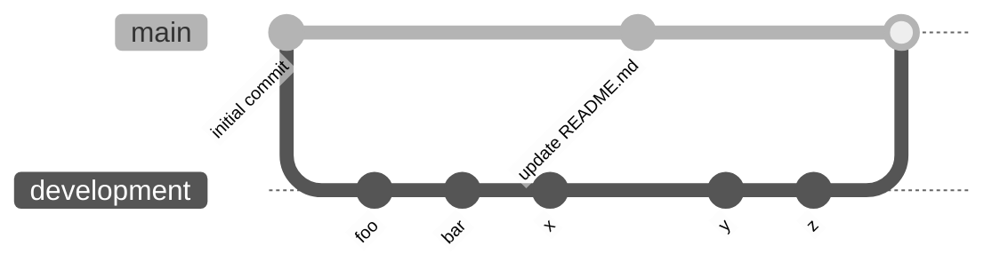

# Gcnc.svelte

> # ⚠️ June 23: 
> I got to a situation where I think I need to refactor the code so that it is better and so it becomes easy to work with. my idea now is to make it a library based on a global JSON... it is so much better than the code in this repo.
>
> New code here: https://github.com/Laaouatni/gcode-library-refactoring (still in development, don't use it unless you see the main branch with real code than the readme and licence...)

---------

## Readme before June 23:

https://gcnc.netlify.app

It's not completed, just an idea, but I want to create a new way to code GCODE for CNC milling, similar to how we write HTML and TAILWINDCSS/CSS. For now, is not completed, so don't use it.

meanwhile, the development code is in another [`github branch`](https://github.com/Laaouatni/Gcnc.svelte/tree/development) called development

