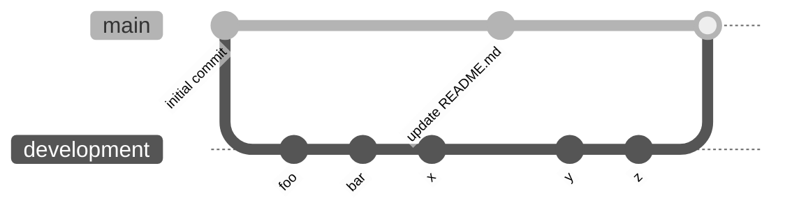

# Gcnc.svelte

> # ⚠️ June 23: 
> I got to a situation 
> <wbr> where I think I need to refactor the code 
> <wbr> so that it is better 
> <wbr> and so it becomes easy to work with. 
>   My idea now is to make it a library based on a global JSON... 
> <wbr> it is so much better than the code in this repo.
> 
> I won't focus anymore on the UI/Design 
> <wbr> but in real logic to make this work 
>   (since from experience from this repo, 
> <wbr> I used a lot of time in styling than coding the logic it self).
>   Once everything will work, then I will make it stylable (with some simple tailwind classes)
>
> New code here: 
> <wbr> https://github.com/Laaouatni/gcode-library-refactoring 
> <wbr> (still in development, 
> <wbr> don't use it, 
> <wbr> unless you see the main branch with real code, 
> <wbr> not only the readme and licence...)

---------

## Readme before June 23:

https://gcnc.netlify.app

It's not completed, just an idea, but I want to create a new way to code GCODE for CNC milling, similar to how we write HTML and TAILWINDCSS/CSS. For now, is not completed, so don't use it.

meanwhile, the development code is in another [`github branch`](https://github.com/Laaouatni/Gcnc.svelte/tree/development) called development

