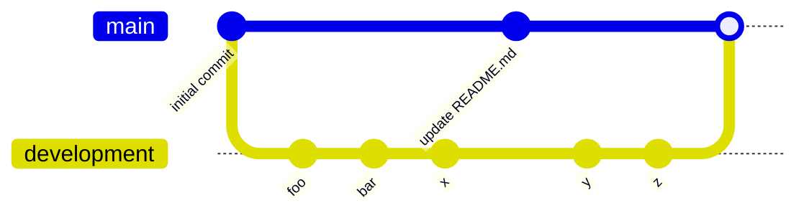

# Gcnc.svelte

not completed, just a idea... but basically I want to create a new way to code GCODE for cnc milling, similar to the way we write HTML and TAILWINDCSS/CSS. for now is not completed, so don't use it.

meanwhile the development code is in another [`github branch`](https://github.com/Laaouatni/Gcnc.svelte/tree/development) called development

